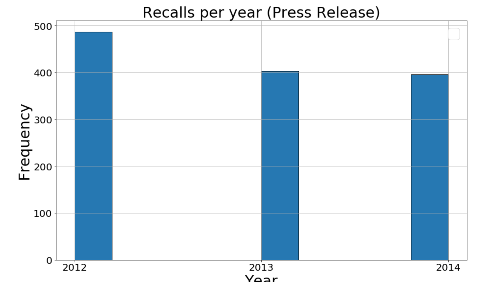

# Improving the user's trust in the Amazon Recommendation System

# Abstract
 Today world has become a highly connected place in which networks are associated in our day-to-day lives. As we begin to enter the new era of Big Data, the contemporary Recommender System faces greatly increased data size and complexities. Previous computational models and experience on small data may not hold today, thus, how to build an efficient and robust system and how to extract meaningful knowledge from the massive data becomes an important issue and attracts increasing attention on it. For a user it is getting harder to reach the relevant food product items according to his/her personal taste and preferences. It could be better and convenient, if the websites give them some smart advices and also could think from customer‘s perspective of view and provide products that customers never thought but will love when they saw them. In our project, we aim at improving the Amazon Product Recommendation System for large scale Amazon groceries and gourmet food dataset by analyzing the reviews of users. 

Using Natural Language Processing (NLP) on the [Amazon Grocery and Gourmet Food Product reviews](http://jmcauley.ucsd.edu/data/amazon/) database and [FDA food recalls](https://open.fda.gov/downloads/), we want to distinguish products that users like and dislike and by building a time based link prediction to provide best recommendations to the customers. 

Our first plan was to directly relate products from the Amazon datasets to ones of the FDA dataset. This would have provided true-values for possible health threats found in the Amazon dataset which could have been used for training and evaluating our models. However, this would have required us to perform conversions between the ASIN (Amazon Standard Identification Number) and the UPC (Universal Product Code) of products in a large scale. Queries like this are restricted by Amazon and therefore not possible for us in our project. In consequence, we decided to still use the FDA dataset but for another purpose. We want to analyze the language in order to possibly link it to the language used in the Amazon reviews. This shall be done by NLP (natural language processing). However, doing that will not solve our problem of missing labels for the products and reviews. To lable our data, we used a work-around using lexical data of words that can be related to health issues and other features of our data.

In our data story we will try show how a general bad review of a product (i.e. because of personal taste or false expectations of the user) should be distinguished from health related ones. Using the FDA dataset will help us relating reviews to actual recalls of food products. The overall goal is to enhance Amazon's user experience by considering possible health threats. This would encourage retailers to maintain quality standards, could improve quality of food products and eventually enhance health and life quality of people.

# Research questions
* Can possibly harmful products from Amazon's grocery and food products be detected by analyzing user reviews?
* How can we integrate language used in FDA food recalls to distinguish between general dislikes and possible health threats in the Amazon reviews?
* Can insights from our research be used to improve Amazon's Recommendation system in regard to protecting Amazon users' health?

# Dataset

We plan to use three datasets:

* [Amazon's Grocery and Gourmet Food product reviews](http://jmcauley.ucsd.edu/data/amazon/) from Julian McAuley, UCSD (University of California, Sandiego)
* [Amazon's Grocery and Gourmet Food product metadata](http://jmcauley.ucsd.edu/data/amazon/) (to be able to link the reviews' asin field with an actual product name) from Julian McAuley, UCSD (University of California, Sandiego)
* Food Recall Enforcement Reports from [FDA](https://open.fda.gov/downloads/) from Food and Drug Administration (FDA)

Below Table shows the number of user reviews and number of products for Amazon's Grocery and Gourmet Food:

| Number\ Category  | Grocery and Gourmet  |
| ------------- | ------------- |
|Reviews  | 1,297,156   |
| Products  | 171,760  |

The format of the files for both metadata and reviews dataset was json. The size of each
raw data set is presented in the Table below:

| Size\Category  | Grocery and Gourmet Food  |
| ------------- | ------------- |
|Reviews  | 733.5 MB   |
| Products  | 196.8 MB  |

The data collected is very huge spanning from 2000-2014. Therefore first the data was
analyzed for number of reviews for each year in order to choose the years for parsing the
data set for testing and validating phase for the recommender system.

Below is an example of Amazon product Review parser(year wise) code:

From the above chart it clearly visible that larger reviews are available only in few years,
that is in the case:
* Grocery and Gourmet Food -
     1. (2012 - 192903)
     2. (2013 - 466834)
     3. (2014 - 338303)

Below is a histogram of Total Recalls per year for FDA Dataset(Enforcement Data)

Below is a histogram of Total Recall per year for FDA dataset(Press Release Data)

        
# A list of internal milestones up until project milestone 

* 30.10---**DOWNLOAD THE REQUIRED DATA**
    
     1. Set up the Git and project skeleton.
     2. Summarize the data.
     3. Analyze the data. (Format, Structure, Size)
     4. Preprocess Data (Remove Duplicates).
     5. Draw Conclusions, make Inferences or Decision about the dataset after observing only a subset – a sample from it 

* 3.11---**DATA AND FEATURE ENGIEERING**

     1. Analyze the given features of Amazon reviews, Amazon metadata and FDA dataset.
     2. Understand existing recommendation system approaches (for example collaborative filtering, content based filtering, hybrid recommendation engine, graph based recommednation system) by reviewing many research articles.
     3. Look what can be improved (for example by reading the future research suggestions by the authors/ by figuring out any pitfalls in the existing work)
      
    

* 19.11---**MODEL SELECTION**

     1. Explore various NLP approaches to detect and classify possibly harmful products by analyzing user product reviews and FDA Recall Reason text.
     2. Compare time points of health related negative reviews and FDA product recalls.
     3. Append an additional rating to the positive/negative one that is provided by NLTK
     4. Find the most powerful way to store and look up all our data (Example:  Using High performace graph based libraries like SNAP (Stanford Network Analysis Platform))
     5. Explore various graph mining Algorithms to group similar users and similar products from the Amazon dataset.
     6. Construct a Bipartite graph and explore various link prediction algorithms (for example Common Neighbors, Jaccard Coefficient, Adamic-Adar or IR based algorithms)

    
* 26.11---**MODEL VALIDATION**

     1. Generates recommendations for all users and Analyze the recommendations: Calculates accuracy of the recommendations by comparing against ground truth (for example Run the algorithm on the training set, and test it on the validation set). 

* 31.11---**DEBUGGING AND WRITING THE DATA STORY**

     1. Comment and debug our code
     2. Write the data story.

# Questions for TAa
* We would like to utilize the cluster to check for the performance of our code. Is there any guideline that can be provided?

* Can we alter some of our subgoals without affecting the main goal.

* Data sparsity is a problem in amazon dataset, we will try to choose appropriate algorithms and reason our work, But what if the the predictions are not good enough? 

=======
# Project Structure
        Project
        |-- _data
        │   |-- __init__.py
        │   |-- cli.py
        │   |-- lib.py
        |
        |-- _notebooks
        |-- _docs
        │   |-- __init__.py
        │   |-- test_fact.py
        |-- _tox.ini
        |-- _setup.py
        |-- _results
        |-- _requirements.txt
        |-- _src
        |   |-- d00_utils
        |   |-- d01_data
        |   |-- d02_intermediate
        |   -- d03_processing
        |   |-- d04_model_evaluation
        |   |-- d05_reporting
        |   |-- d06_visualization
        |-- _modelling
            |-- train_model.py
        |-- _visualise_recommendation.py
