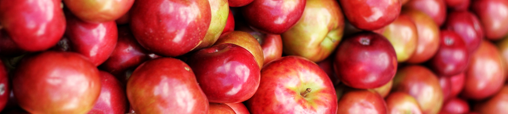

This is the website for the data story of our group project in the [Applied Data Analysis](https://dlab.epfl.ch/teaching/fall2019/cs401/) course at [EPFL](https://www.epfl.ch/), Switzerland in Autumn semester 2019.

We are the group "Data Saviors": 
* [Kamalesh Kumar Kanakaraj](https://github.com/KKanakaraj)
* [Keijiro Tajima](https://github.com/KeijiroTajima)
* [Fares Ahmed](https://github.com/FaresAh)
* [Nikolas Roßkopf](https://github.com/nikoro1904)

For our project, we had different food and nutrition related datasets to choose from. We decided to work on a one of [Amazon Reviews of Food and Grocery products](http://jmcauley.ucsd.edu/data/amazon/) purchased in the US from **?** to **?**. We analyzed various aspects with the overall goal of improving the Amazon Recommendation system in regard to detecting possible health threats for customers.

This Website is hosted by [Github-Pages](https://pages.github.com/) and was built using [Jekyll](https://jekyllrb.com/). The theme we used is [Minima](https://github.com/jekyll/minima).

Lausanne, Switzerland. 10 December 2019.

