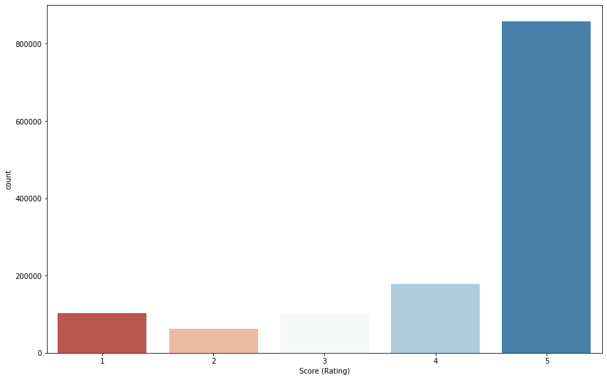
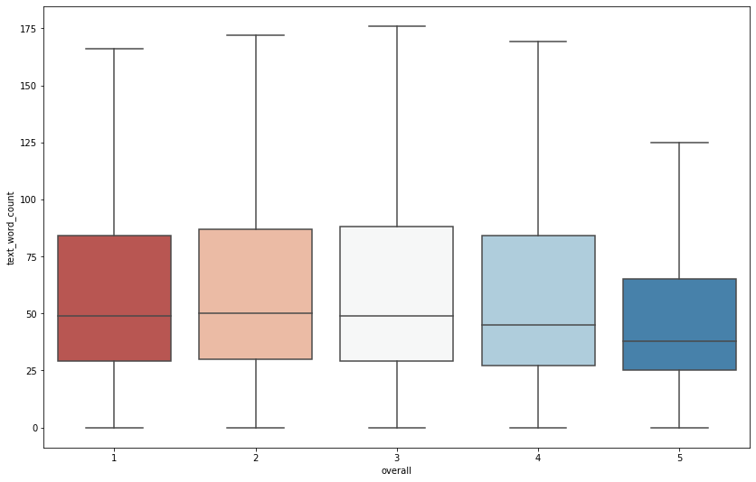
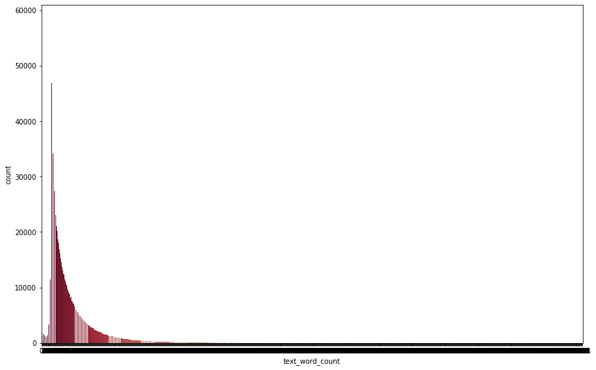
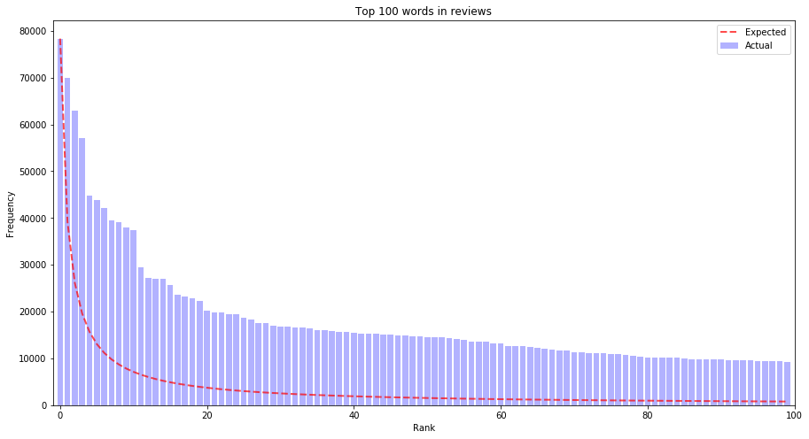
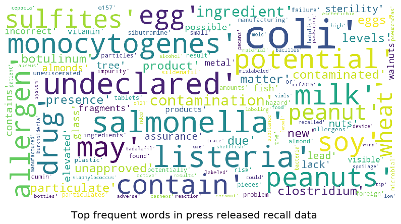

---
#
# By default, content added below the "---" mark will appear in the home page
# between the top bar and the list of recent posts.
# To change the home page layout, edit the _layouts/home.html file.
# See: https://jekyllrb.com/docs/themes/#overriding-theme-defaults
#
layout: home
---

## Teaser*

People buy anything on Amazon nowadays, because it’s so unbelievably simple. You just order it and when you don’t like it, you send it back. This concept might work well for electronic devices or clothing, but gets difficult when it comes to food and groceries. Once you have your food intoxication, you can maybe try to sue Amazon for that, but before you’re successfull you might already have passed away. Of course this can also happen in your local store, the advantage of Amazon is the BIG DATA that comes along with it. Usually, people don’t die directly from contaminated food, so they have time to complain about their purchases - and they do! When being displeased with products, they write angry reviews about them. The question for a data scientist now is: **by analyzing Amazon reviews of food products and groceries, can we detect dangerous, possibly contaminated or intoxicated products?** That question was part of our project and will be adressed in the following data story!

*[not to be taken seriously]

## Introduction

Since it was founded in 1994, Amazon is constantly growing. More and more customers as well as dealers use Amazon, because it simplifies daily life. Nowadays, you can even buy food on Amazon. This may offer great possibilties for health agencies as the U.S. Food and Drug Agency (FDA). Amazon knows exactly who sold and who bought each product and could use this information to inform dealers and customers about warnings and recalls for specific products by the FDA. This would provide a great service to the public, e.g. for allergic people when the FDA found a missing declaration of allergens.

However, one could even go a step further by trying to detect potential health issues before the FDA even took a look at it. We propose that it may be possible to detect potentially hazardeous food products on Amazon by analyzing customer reviews. In the following article, we are going to show several approaches to classify Amazon reviews of food products in regard to whether their product being a potential health threat or not.

#### What our dataset is about

The main dataset we used contained Amazon reviews of food products from several years. Each datapoint had information about the reviewer's ID, the product ID, the date of purchase, the review text itself and the overall rating the customer gave the product (an integer score going from one star (worst option) to five stars (best option). The reviews in our dataset do mainly come from 2012, 2013 and 2014. Though our analysis cannot claim for actuality, we can assume the data's characteristics (i.e. the length or the the vocabulary used in the reviews) has not changed since then. Conclusions about the potential danger of individual products, however, can not be made.

A good measurement for the overall satisfaction of customers with a product probably is the rating, given in one to five stars. As we can see, most ratings were excellent. That's not ideal for us as we want to focus on negative reviews, even on particularly health related ones. 

At least the following boxplot shows that the number of words per review might be sufficient to perform text analysis methods on them. 

That wasn't necessarily expectable, if one takes a look at the following histogram of review length frequency. As one can see, does the distribution follow a power law. Most reviews are very short and longer ones are rare, but not very rare.

What was expectable and can nicely be shown in the following histogram is the distribution of individual word frequencies over the whole dataset. It was observed that this distribution commonly follows a power law which is called Zipf's law in text analysis. 

To be able to label the reviews in the dataset as potentially health threatening or not, we tried to link the corresponding products in two other datasets of food recalls and press releases of the US American Food and Drug Administration (FDA). Unfortunately, this was not possible as Amazon and the FDA use different Product IDs which cannot be matched (free of charge). In consequence, we had to find a work around. 

In consequence, we used several approaches for labelling the reviews:

#### empath C1
create  lexicon of words related to "health", "danger", "food poisoning"  
new column: health score  
new column: danger: healthScore > 0 AND rating smaller than 4  
danger is either 1 or NaN  
3755 reviews labeled with 1  
take sample of all danger=NaN reviews  -> negative_sample  
in empathy, replace danger=NaN with danger=0  
save empathy to pickle  

#### afinn C2
add afinn columns by processing stemmed df  
add afinn columns by processing stemmed_frequent=stemmed.copy(), afinn calculations done on list of frequentWords (are actually same as all words as there are only ~25000 words.  

No actual labelling  

#### FDA datasets
find frequent words in both FDA datasets  

We analyzed the notes coming with the product recalls from FDA and tried to find specific vocabulary which is used in health threat related issues.  
In the following wordcloud it is clearly visible that this will still remain a challenging task, as there are general groceries like "egg" or "peanuts" and specialist terms like "monocytogenes" as well.

### Classification
load pickle empath
drop columns date, categories, brand, overall
tokenReviews -> tokenize, remove stopwords, stem
vectorize tokenReviews -> feature column
train the classifier (random forest) with all reviews that have danger=1

Accuracy of classifier = 0,839

take all so far unlabelled reviews (danger=NaN), classify them
merge them into the df from previously labelled/classified reviews

