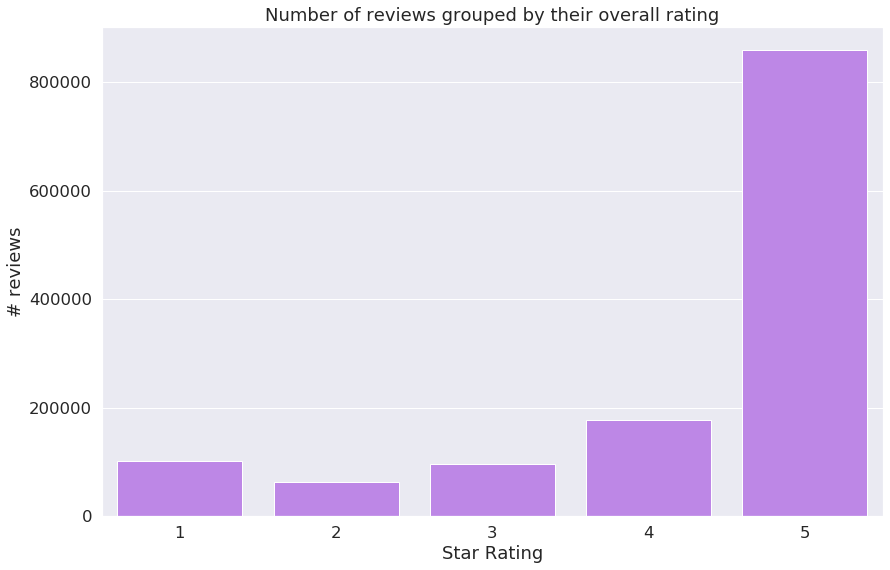
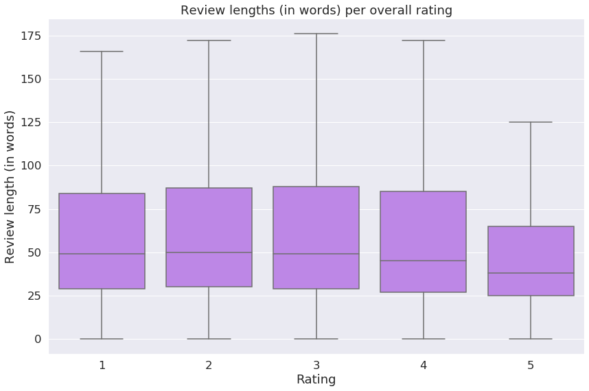
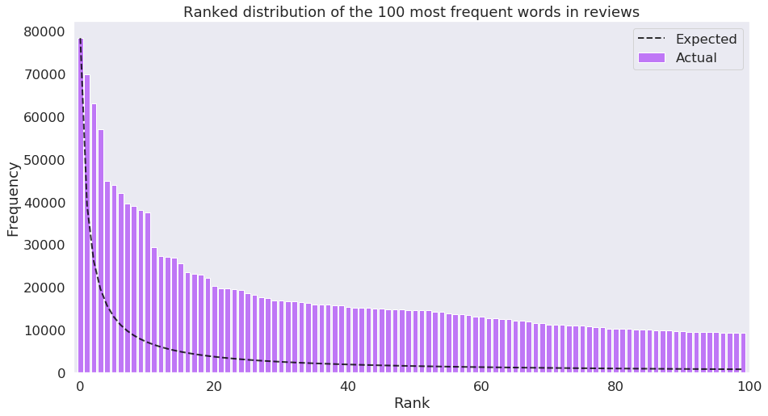

---
#
# By default, content added below the "---" mark will appear in the home page
# between the top bar and the list of recent posts.
# To change the home page layout, edit the _layouts/home.html file.
# See: https://jekyllrb.com/docs/themes/#overriding-theme-defaults
#
layout: home
---

## Teaser*

People buy anything on Amazon nowadays, because it’s so unbelievably simple. You just order it and when you don’t like it, you send it back. This concept might work well for electronic devices or clothing, but gets difficult when it comes to food and groceries. Once you have your food intoxication, you can maybe try to sue Amazon for that, but before you’re successfull you might already have passed away. Of course this can also happen in your local store, the advantage of Amazon is the BIG DATA that comes along with it. Usually, people don’t die directly from contaminated food, so they have time to complain about their purchases - and they do! When being displeased with products, they write angry reviews about them. The question for a data scientist now is: **by analyzing Amazon reviews of food products and groceries, can we detect dangerous, possibly contaminated or intoxicated products?** That question was part of our project and will be adressed in the following data story!

*[not to be taken seriously]

## Introduction

Since it was founded in 1994, Amazon is constantly growing. More and more customers as well as dealers use Amazon, because it simplifies daily life. Nowadays, you can even buy food on Amazon. This may offer great possibilties for health agencies as the U.S. Food and Drug Agency (FDA). Amazon knows exactly who sold and who bought each product and could use this information to inform dealers and customers about warnings and recalls for specific products by the FDA. This would provide a great service to the public, e.g. for allergic people when the FDA found a missing declaration of allergens.

However, one could even go a step further by trying to detect potential health issues before the FDA even took a look at it. We propose that it may be possible to detect potentially hazardeous food products on Amazon by analyzing customer reviews. In the following article, we are going to show several approaches to classify Amazon reviews of food products in regard to whether their product being a potential health threat or not.

### What our dataset is about

This is an example of reviews and overall ratings in our dataset:

| index | reviewText  |   overall |
|--------:|:------|-----|
|375427 | If you have ever had a waffle from Liege,Belgium then you will want this sugar.  |         5 |
| 1077862 | Received this item and every box in there was expired and we're talking REALLY expired... going back to May 2012 and it's now Oct 2012.  PLUS, there's a recall out on all Cascadian Farm Granola Bars that are either expired and/or contain peanuts.  I actually received notice of this recall from Amazon's Safety Dept. the same day I placed the order.  I thought they would at least check this order BEFORE it went out to insure all items were in compliance, but no such luck.  The recall by the FDA said you are to THROW THEM AWAY and this is exactly what I did.  (shortened)|         1 |
|  625771 | These are amazing. They turn out great every time. They do taste better than the overpriced prepackaged ones. Now I can let my family share in this healthy treat instead of keeping them all to myself. This will definitely be a repeat purchase I will buy at least once a month.      |         5 |
|  139774 | My medical school was a little short on &#34;standardized patients&#34; for us to learn rectal exams on this week, so I think it was the professors who left one of these bags out for my class to snack from. By the afternoon they had a lot of clean colons at their disposal for teaching purposes. Maybe this is why we didn't learn about lycasin in biochemistry class... |         1 |  

The [main dataset](http://jmcauley.ucsd.edu/data/amazon/) we used contained Amazon reviews of food products from several years. We joined this dataset with [another one](http://jmcauley.ucsd.edu/data/amazon/) containing meta information about the products. Each datapoint had information about the reviewer's ID, the product ID, the date of purchase, the review text itself and the overall rating the customer gave the product (an integer score going from one star (worst option) to five stars (best option). The overall 1.3 million reviews in our dataset do mainly come from 2012, 2013 and 2014. Though our analysis cannot claim for actuality, we can assume the data's characteristics (i.e. the length or the the vocabulary used in the reviews) has not changed since then. Conclusions about the potential danger of individual products, however, can not be made.

A good measurement for the overall satisfaction of customers with a product probably is the rating, given in one to five stars. As we can see, most ratings were excellent. That's not ideal for us as we want to focus on negative reviews, even on particularly health related ones. 

At least the following boxplot shows that the number of words per review might be sufficient to perform text analysis methods on them. 

That wasn't necessarily expectable, if one takes a look at the following histogram of review length frequency. As one can see, the distribution does follow a power law. Most reviews are very short and longer ones are rare, but not very rare.

What was expectable and can nicely be shown in the following histogram is the distribution of individual word frequencies over the whole dataset. It was observed that this distribution commonly follows a power law which is called Zipf's law in text analysis. 

## Labelling of reviews

Our goal was now to build a model and train a supervised machine learning based classifier on our dataset of Amazon reviews in order to be able to classify reviews as either "potentially health threatening" (or short "dangerous") or as "probably not health threatening" (or short "safe"). The most challenging part of this was to distinguish between general dislikes and health concerning dislikes.

Training the classifier means showing many many examples of reviews and thereby telling it whether they are dangerous or safe. As the model our classifier is based on we chose a [Random Forest](https://en.wikipedia.org/wiki/Random_forest) algorithm. A Random Forest is basically a bunch of many decision trees, each is trained on a different bootstrap sample of the whole data. A majority vote among all trees then classifies the input.

However, for training the classifier, we need labeled data. To be able to label the reviews in the dataset as potentially health threatening or not, we thought of different approaches:

* One approach was to use [AFINN Sentiment Analysis](https://darenr.github.io/afinn/) (Rowe et al, 2011). Afinn is a python library for [sentiment analysis](https://en.wikipedia.org/wiki/Sentiment_analysis), i.e. it classifies a text document as positive, neutral or negative by summing up scores or individual words. E.g. the word "horrible" has a score of -3, the word "inconvenient" has a score of -2, meaning it is less severe than "horrible". Afinn also contains health related words (e.g. "headache" or "vomit"), nevertheless we chose not to use it for labelling the reviews. Sentiment analysis is obviously made for distinguishing general emotion and not for assessing health issues in text.
* The second idea was to link the reviews to corresponding products in two other datasets of food recalls and press releases of the US American [Food and Drug Administration](https://www.fda.gov/) (FDA). This would have provided us very reliable labels made by professionals. Unfortunately, it was not possible as Amazon and the FDA use different Product IDs which cannot be matched (free of charge). In consequence, we had to find a work around:
* From various sources (see below) we imported words related to food, food safety, symptoms and pathogens (e.g. bacteria like salmonella)

| **Pathogen and disease words (e.g. salmonella)** |  |
| --- | --- |
| EU safe food | [Link](https://www.safefood.eu/SafeFood/media/SafeFoodLibrary/Documents/Education/safefood%20for%20life/NI/section2_1.pdf) |
| Foodsafety.gov bacteria and viruses words | [Link](https://www.foodsafety.gov/food-poisoning/bacteria-and-viruses) |
| CDC foodborne illness words | [Link](https://www.cdc.gov/foodsafety/diseases/index.html) |
| CDC national outbreak reporting system | [Link](https://wwwn.cdc.gov/norsdashboard/) |
| **Symptom words (e.g. embolism)** |  |
| EU safe food | [Link](https://www.safefood.eu/SafeFood/media/SafeFoodLibrary/Documents/Education/safefood%20for%20life/NI/section2_1.pdf) |
| Foodsafety.gov symptom words | [Link](https://www.foodsafety.gov/food-poisoning) |
| Symptom dictionary  | [Link](https://github.com/sekharvth/symptom-disease) |
| **Food words (e.g. egg)** |  |
| Exhaustive list of all foods & food items in the world | [Link](https://github.com/CurtisGrayeBabin/List-of-all-Foods) |

By analyzing these sources together with the FDA datasets we created lists of words that relate to either pathogens and diseases or symptoms, respectively. However, we decided not to use them for labelling but for post classification analysis as they contain actual threats like the names of bacteria and not vocabulary that might be used to describe their effects.

* The fourth approach, which we used in the end, is based on [Empath](https://github.com/Ejhfast/empath-client). Empath is a python library for sentiment analysis and topic detection. It was created by Fast et al. (2016). The Empath lexicon contains a network of more than 1.8 billion (English) words. When providing it some seed words, it can create a small set of related words, you can thereby build new categories of sets of words (try it [here](http://empath.stanford.edu/)). For our category of health threat related words, we used the seed words "health", "danger" and "food poisoning". 

Empath created a category containing the following 100 words:  

We used them to categorize the Amazon reviews by assigning a "health score" to each review, i.e. each review gets an integer value representing how many words of our lexicon can be found in the review. As can be seen in the distribution of health scores, most reviews had a score of 0, signifying no potential danger at all. Note the logarithmic scale of the y-axis.

Comparing the health score to the overall rating the reviewers gave showed a surprising result: Many reviews containing a high health score were rated with 5 of 5 stars indicating the product fullfilled the reviewers expectations. Manual inspection of those reviews revealed them to be more like advertisements for the corresponding products. Only when reviewers gave 3 or less stars and there was at least one word of our lexicon was used, we could identify them as "reporting a potential health threat".  
From the complete dataset of 1.3 million reviews, this allowed us to label only 20,000 (that's only 1.6%). We then labelled a random sample of 130,000 remaining reviews as "safe". This labelled fraction of the complete dataset of around 150,000 reviews (that's 11.4% of all reviews) will then be our training and testing dataset for the machine learning classifier.

## The actual machine learning part
As mentioned above, we used a [Random Forest](https://en.wikipedia.org/wiki/Random_forest) model. But before training and testing it, we preprocessed the review text, i.e. we removed stopwords (short and meaningless words like "I", "and", "or") and stemmed the remaining words, i.e. plural words become singular and all verbs are changed to their bare infinitive. Moreover, we tokenized the reviews, i.e. transformed it from one big string to a list of small strings (each string is now only one stemmed word). In consequence this transformed the sentence  

	'I ordered spongebob slippers and I got John'
	
to 

	['order', 'spongebob', 'slipper', 'got', 'John'].

Each review now has a "tokenized review" built from its stemmed, stopword-removed and tokenized review text. To make these handable by a Machine Learning algorithm, we converted them into vectors using Word2Vec. Word2Vec transforms text objects to multidimensional numerical vectors. Semantically similar words get similar vectors inside the vectorspace. We split all previously labelled reviews in 90%-10% training/validation sets. Because there were much less reviews labelled as "dangerous" compared to "safe" ones, we made sure the ratio of dangerous to safe reviews in all splits was similar. 

After training, we tested the classifier on the remaining labelled reviews. This yielded a quite impressing [Accuracy](https://en.wikipedia.org/wiki/Evaluation_of_binary_classifiers) score of 88.6%. We are very happy with that so we used the classifier for classifying the remaining about 89% of the dataset.

**Overall, this resulted in 33,900 reviews classified as dangerous what is 2.62% of all reviews. From the labelling using the empath lexicon we had 20,235 dangerous reviews, so our classifier detected more than 13,000 additional ones. **

### Contributors
This data story was created by the group "Data Saviors". More detailed descriptions of individual contributions see the About page.

### Bibliography
* Finn Årup Nielsen, "A new ANEW: evaluation of a word list for sentiment analysis in microblogs", Proceedings of the ESWC2011 Workshop on 'Making Sense of Microposts': Big things come in small packages. Volume 718 in CEUR Workshop Proceedings: 93-98. 2011 May. Matthew Rowe, Milan Stankovic, Aba-Sah Dadzie, Mariann Hardey (editors)
* Fast E, Chen B, Bernstein MS. Empath: Understanding topic signals in large-scale text. In: Conference on Human Factors in Computing Systems - Proceedings. ; 2016. doi:10.1145/2858036.2858535

